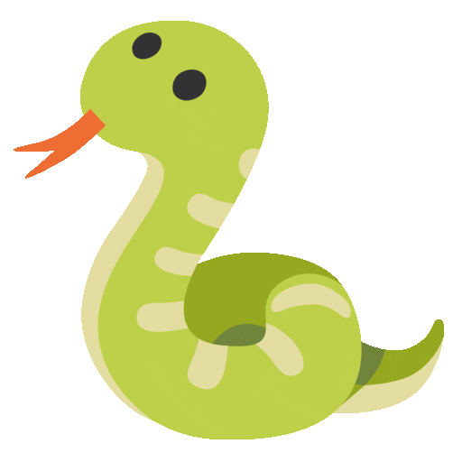
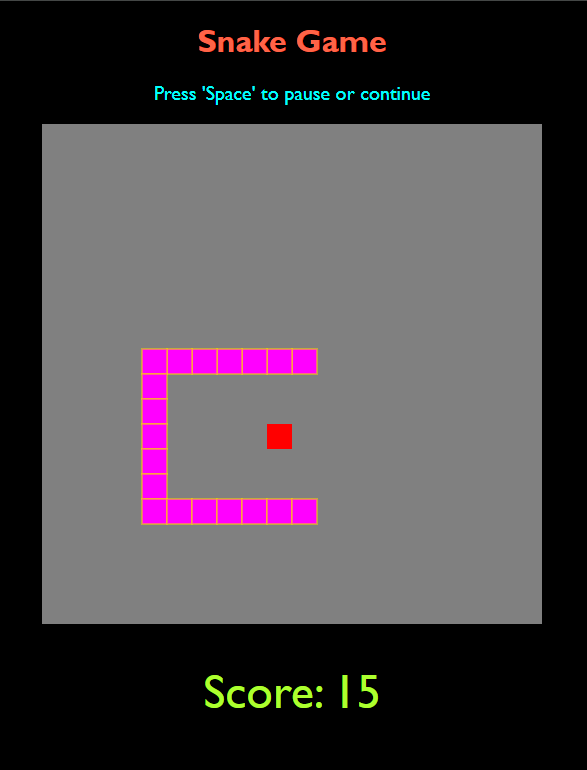
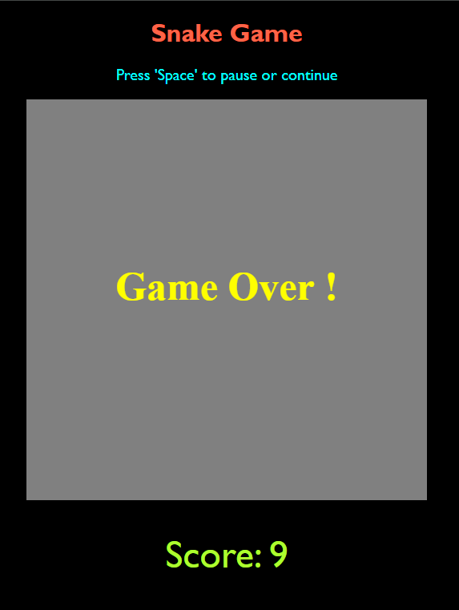

# Snake Game Project (Vanilla)

This project is created with HTML, CSS and Java Script.

    Simple 🐍 Snake Game.

`canvas` tag used in this project to create
**SNAKE GAME.** 

-   Game Board size are 500 X 500 pixels of square box.
-   Food appears randomly in Game Board.
-   Game Score is displayed.
-   Game can be paused and continued by <ins>`Space Bar`</ins>

**Help** from [Logic First Tamil](https://www.youtube.com/watch?v=0Ihn9HQ3iJM&list=PLYM2_EX_xVvUIaivxb63BXAI7hhjcLwpn&index=13) YouTube channel for the Web Development Project.

**Project Count**: <h1>04</h1>

> on **_04 Jan 2024_** 📅

## Output - 🖥️ Screen Shots (💡SS)

Game Starting Position & Press `Arrow` key to Start Game. 
In **💡SS** you can see the Starting Position of Snake & Food. 
[Desktop Full Output 1](/screen-shot/snake-game-img-1.png)
  
`Game play`. In **💡SS** you can see the  Snake, Food & Score. 
[Desktop Full Output 2](/screen-shot/snake-game-img-2.png)   
Incase snake hits the `Wall` or snake hits `it own` body, This Game is Over!. 
In **💡SS** you can see the  Game Over ! 
[Desktop Full Output 3](/screen-shot/snake-game-img-3.png)   

## **SNAKE GAME PLAY & GAME OVER WITH SCORE** 

<!--     -->

  

 

<!--     -->

<!--    -->

> # Thank You
